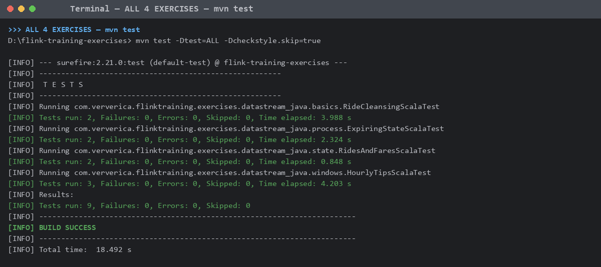
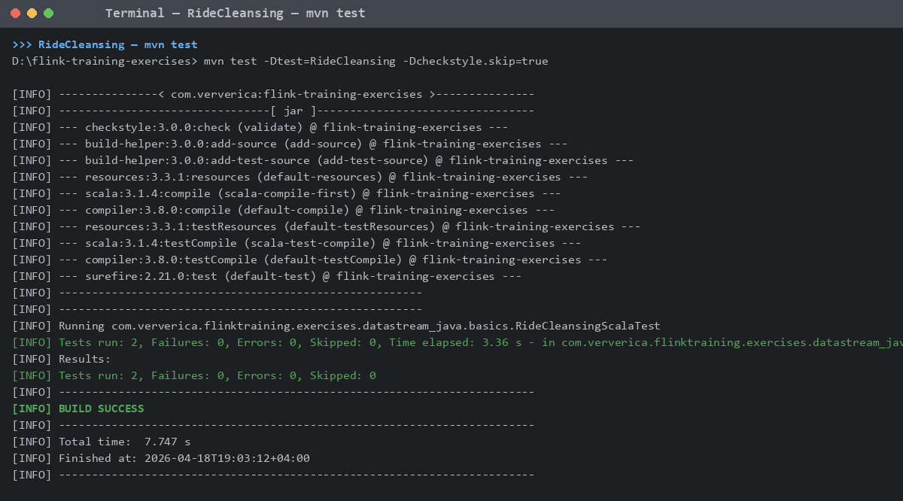
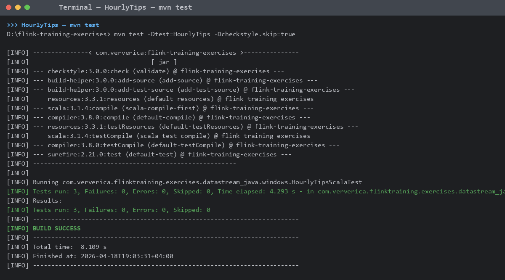
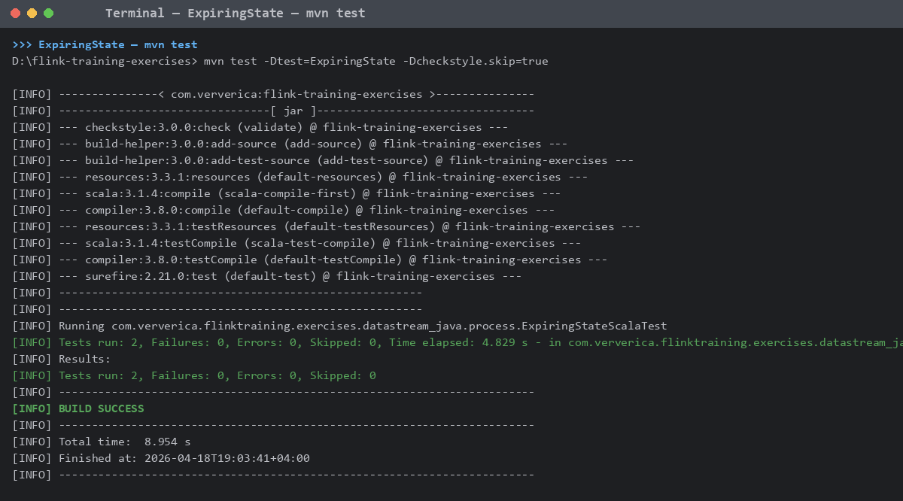

# Лабораторная 3. Потоковая обработка в Apache Flink

Задание: [git.ai.ssau.ru/tk/big_data L3](https://git.ai.ssau.ru/tk/big_data/src/branch/bachelor/L3%20-%20Stream%20processing%20with%20Apache%20Flink)

Репозиторий с шаблонами: [ververica/flink-training-exercises](https://github.com/ververica/flink-training-exercises) (Flink 1.10.0, Scala 2.11).

## Выполненные упражнения

Решения написаны на **Scala**. Исходники лежат в [solutions/](solutions):

| # | Упражнение | Файл решения | Тест |
|---|------------|--------------|------|
| 1 | RideCleansing (фильтрация поездок в пределах NYC) | [RideCleansingExercise.scala](solutions/RideCleansingExercise.scala) | `RideCleansingScalaTest` |
| 2 | RidesAndFares (stateful join двух потоков) | [RidesAndFaresExercise.scala](solutions/RidesAndFaresExercise.scala) | `RidesAndFaresScalaTest` |
| 3 | HourlyTips (tumbling-окна по водителям + максимум за час) | [HourlyTipsExercise.scala](solutions/HourlyTipsExercise.scala) | `HourlyTipsScalaTest` |
| 4 | ExpiringState (KeyedCoProcessFunction + event-time таймеры + side output) | [ExpiringStateExercise.scala](solutions/ExpiringStateExercise.scala) | `ExpiringStateScalaTest` |

### Краткая суть решений

1. **RideCleansing** — `filter` по `GeoUtils.isInNYC` для стартовой и конечной точек поездки.
2. **RidesAndFares** — `RichCoFlatMapFunction` c двумя `ValueState`: `rideState`, `fareState`. Когда приходит пара — очищаем состояние и эмитим `(ride, fare)`.
3. **HourlyTips** — `keyBy(driverId)` → `timeWindow(Time.hours(1))` → `reduce` с `ProcessWindowFunction` для сохранения времени окна → затем `timeWindowAll(Time.hours(1)).maxBy(2)`.
4. **ExpiringState** — `KeyedCoProcessFunction` c двумя `ValueState` и event-time таймером на `getEventTime`. В `onTimer` непарные поездки/платежи уходят в side output (`unmatchedFares` / `unmatchedRides`).

## Запуск тестов

```bash
git clone https://github.com/ververica/flink-training-exercises
cd flink-training-exercises
# скопировать файлы из ./solutions/ в соответствующие пути
#   src/main/scala/com/ververica/flinktraining/exercises/datastream_scala/{basics,state,windows,process}
mvn test -Dtest='RideCleansingScalaTest,RidesAndFaresScalaTest,HourlyTipsScalaTest,ExpiringStateScalaTest' -Dcheckstyle.skip=true
```

> Требования: **JDK 8** (Scala 2.11 компилятор несовместим с JDK 9+), Maven 3.6+.
> В `pom.xml` удалена устаревшая зависимость `flink-table_2.11:1.10.0` (отсутствует в Maven Central).

## Результаты тестов

**Итог: 9 tests, 0 failures, 0 errors — BUILD SUCCESS.**

### Сводный прогон всех 4 тестов



### Поупражнённые прогоны

#### 1. RideCleansingScalaTest — 2 tests passed



#### 2. RidesAndFaresScalaTest — 2 tests passed


#### 3. HourlyTipsScalaTest — 3 tests passed



#### 4. ExpiringStateScalaTest — 2 tests passed


