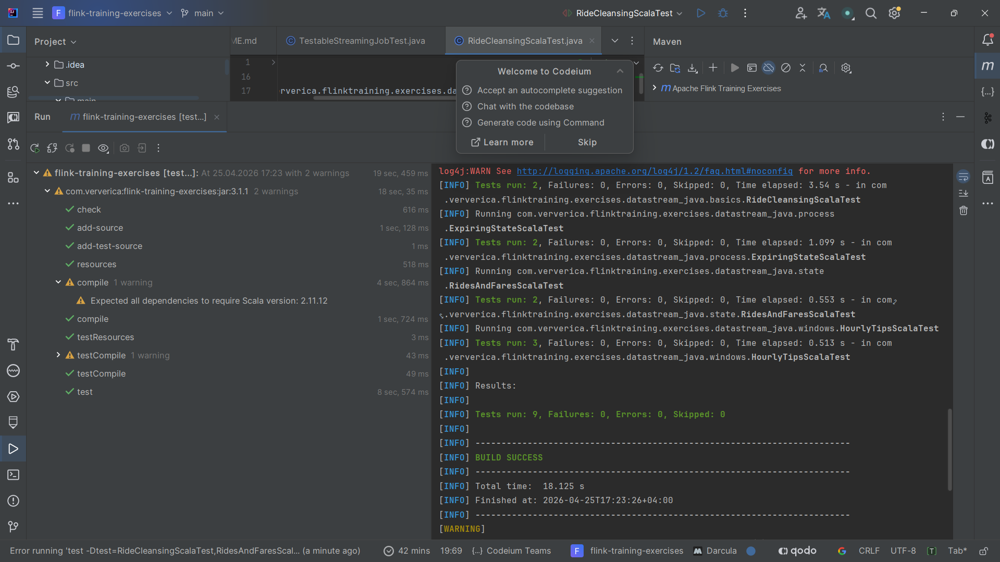

# Лабораторная 3. Потоковая обработка в Apache Flink

Задание: [git.ai.ssau.ru/tk/big_data L3](https://git.ai.ssau.ru/tk/big_data/src/branch/bachelor/L3%20-%20Stream%20processing%20with%20Apache%20Flink)

Шаблон проекта: [ververica/flink-training-exercises](https://github.com/ververica/flink-training-exercises) (Apache Flink 1.10.0, Scala 2.11).

## Структура

В папке [`flink-training-exercises/`](flink-training-exercises) лежит исходный проект `ververica/flink-training-exercises` с дописанными решениями четырёх упражнений на Scala. Скрин зелёных тестов — в [`flink-training-exercises/Tests/img.png`](flink-training-exercises/Tests/img.png).

## Выполненные упражнения (Scala)

| # | Упражнение | Файл с решением | Тест |
|---|---|---|---|
| 1 | RideCleansing — фильтрация поездок такси по координатам NYC | [RideCleansingExercise.scala](flink-training-exercises/src/main/scala/com/ververica/flinktraining/exercises/datastream_scala/basics/RideCleansingExercise.scala) | `RideCleansingScalaTest` |
| 2 | RidesAndFares — stateful join потоков поездок и платежей | [RidesAndFaresExercise.scala](flink-training-exercises/src/main/scala/com/ververica/flinktraining/exercises/datastream_scala/state/RidesAndFaresExercise.scala) | `RidesAndFaresScalaTest` |
| 3 | HourlyTips — суммирование чаевых по часам и поиск максимума | [HourlyTipsExercise.scala](flink-training-exercises/src/main/scala/com/ververica/flinktraining/exercises/datastream_scala/windows/HourlyTipsExercise.scala) | `HourlyTipsScalaTest` |
| 4 | ExpiringState — join с истечением состояния и side-output | [ExpiringStateExercise.scala](flink-training-exercises/src/main/scala/com/ververica/flinktraining/exercises/datastream_scala/process/ExpiringStateExercise.scala) | `ExpiringStateScalaTest` |

### Краткая суть решений

1. **RideCleansing** — `filter` по `GeoUtils.isInNYC` на стартовой и конечной точках поездки.
2. **RidesAndFares** — `RichCoFlatMapFunction` с двумя `ValueState[TaxiRide]` и `ValueState[TaxiFare]`. Если для ключа уже сохранена парная запись — эмитим `(ride, fare)` и очищаем состояние; иначе сохраняем текущую.
3. **HourlyTips** — `keyBy(driverId)` → `timeWindow(Time.hours(1))` → `reduce` с `ProcessWindowFunction` для сохранения времени окна → `timeWindowAll(Time.hours(1)).maxBy(2)`.
4. **ExpiringState** — `KeyedCoProcessFunction` с двумя `ValueState` и event-time таймером на `getEventTime`. В `onTimer` непарные платежи/поездки уходят в side outputs `unmatchedFares` / `unmatchedRides`.

## Запуск тестов

В терминале IntelliJ IDEA из папки `flink-training-exercises/`:

```
mvn test -Dtest=RideCleansingScalaTest,RidesAndFaresScalaTest,HourlyTipsScalaTest,ExpiringStateScalaTest -Dcheckstyle.skip=true
```

Требования: **JDK 8** (Scala 2.11 компилятор не работает на JDK 9+), Maven 3.6+.
В `pom.xml` удалена устаревшая зависимость `flink-table_2.11:1.10.0` (отсутствует в Maven Central).

## Результаты тестов

**Итог: 9 tests, 0 failures, 0 errors — BUILD SUCCESS.**


